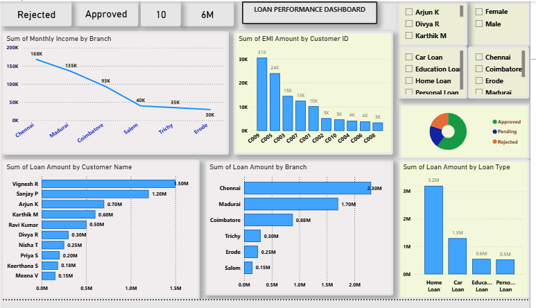

# Loan Performance Dashboard

## Project Overview

This dashboard analyzes loan performance across branches, loan types, customers, and approval status using Power BI.

## Tools Used
- Power BI
- Excel

## Skills
- Data Visualization
- DAX
- KPI Analysis
- Dashboard Design
## Dataset
- Loan dataset with customer, branch, loan type, EMI and approval status.

## Key Insights
- Chennai branch has the highest loan amount.
- Home loans contribute the maximum loan volume.
- Approved loans are higher than rejected loans.

## Features
- Interactive slicers
- KPI cards
- Line chart
- Bar chart
- Pie chart

  
